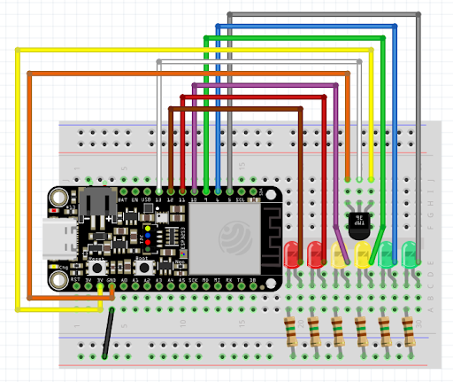

# IoT-assignment
This is David Green and Lewis Low's Internet of Things assignment.

## Instructions on how to run:

### Install Python Flask on your computer:
```
pip install flask
```
### Set up VS code
* Install the PlatformIO extension for VS code
* Once installed, go to the PlatformIO tab on the left side of the screen
* Pick this folder to open with PlatformIO
* You should now see an arrow button at the bottom of the screen labelled Upload and a plug button labelled Serial Monitor - these will be used later

### Update wifi credentials
It is very important for the ESP32 to connect the Python Flask server that you open the [assignment.cpp](./src/assignment.cpp) file and update it with your own wifi SSID, wifi password, and IP address.

### Set up your ESP32 as shown by the diagram below:


### Burn the code to the ESP32:

* Clear any existing burned software
    * Hold down the Boot button on the ESP32
    * Press and release the Reset button on the ESP32
    * Release the Boot button
* Click upload in VS code
* Press the Reset button on the ESP32 once again
* Run the command `python app.py` in this directory to start the Python Flask server
* Go to [http://127.0.0.1:5000](http://127.0.0.1:5000) to view the web page
* Click serial monitor in VS code to see the output of the ESP32

### What you should see
You should now see a continuously updating live temperature feed on the web page. Feel free to test this by putting your fingers over the temperature sensor, heating it up.
You can click the buttons to change the patterns that the LEDS are making.
The Temperature LED pattern updates to represent the current temperature: for each 5 degrees warmer it gets above 0 degrees, one extra light turns on, up to 30 degrees.
